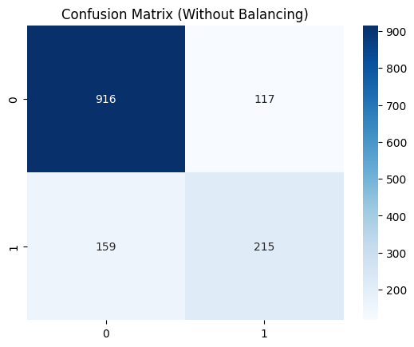
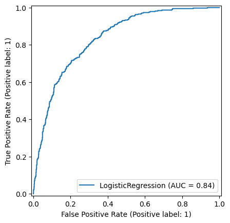
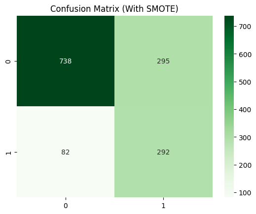

# 📊 Customer Churn Prediction with Imbalanced Data Handling

## 🚀 Project Overview

This project focuses on predicting customer churn using machine learning techniques while addressing class imbalance using **SMOTE (Synthetic Minority Oversampling Technique)**.

The workflow includes:

* Data preprocessing
* Exploratory Data Analysis (EDA)
* Handling imbalanced data
* Model building and evaluation

---

## 📂 Dataset

* Telco Customer Churn dataset
* Source: IBM Sample Dataset

---

## ⚙️ Technologies Used

* Python
* Pandas, NumPy
* Scikit-learn
* Matplotlib, Seaborn
* Imbalanced-learn (SMOTE)

---

## 🔍 Project Workflow

### 1. Data Cleaning

* Handled missing values
* Converted data types
* Removed irrelevant features

### 2. Exploratory Data Analysis (EDA)

* Distribution of churn vs non-churn
* Feature relationships

### 3. Handling Imbalanced Data

* Applied **SMOTE** to balance classes

### 4. Model Building

* Logistic Regression
* (Add more models if used)

### 5. Model Evaluation

* Accuracy
* Precision
* Recall
* F1-score
* Confusion Matrix

---

## 📊 Results

* Improved model performance after applying SMOTE
* Better recall for churn prediction

---

## 📈 Visual Insights

---

## 💡 Key Insights

* Class imbalance significantly affects model performance
* SMOTE improves minority class prediction
* Feature engineering plays a crucial role

---

## 🧠 Future Improvements

* Try advanced models (XGBoost, LightGBM)
* Hyperparameter tuning
* Deploy model using Streamlit

---

## 📌 Author

**Mohammad Saiful Alam**
Research Officer | Data Science Enthusiast

---

## ⭐ If you found this useful, consider giving a star!
